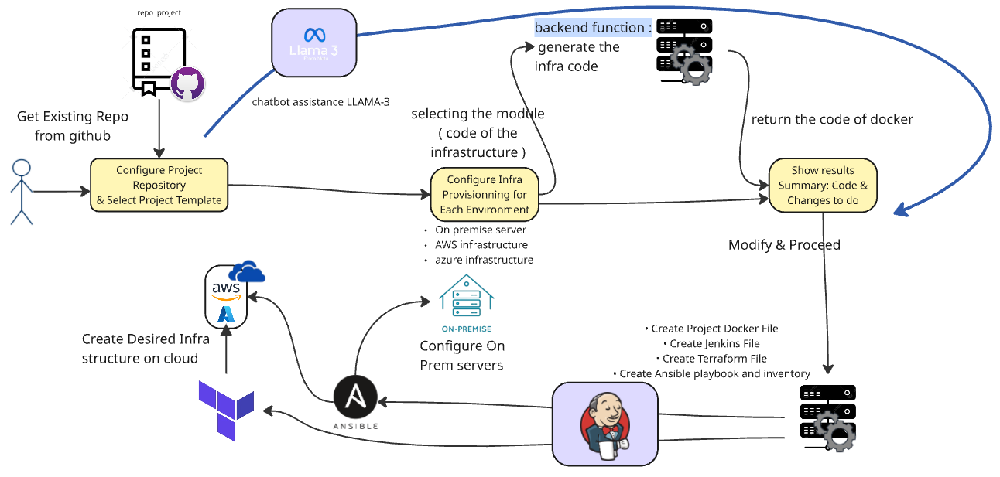
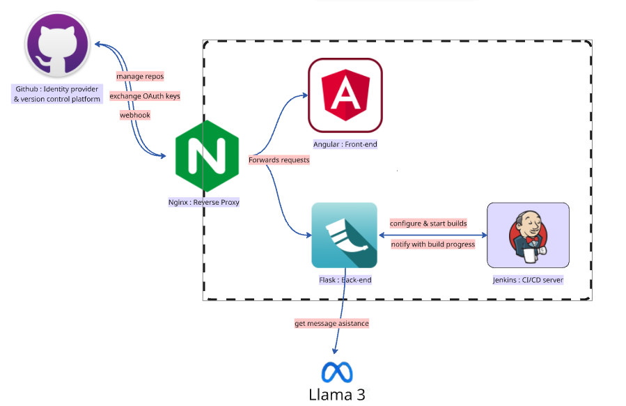

# 🧠 IDP Intelligent Dashboard

An intelligent and automated DevOps platform that helps developers create, manage, and deploy full-stack projects with zero manual infrastructure setup.

## 🚀 Features

- 🌐 Create or connect to existing GitHub repositories
- 🛠️ Choose your tech stack:
  - **Backends**: NodeJS (React, Angular, NextJS), Java (Spring Boot), Python (Flask, Django), PHP (Symfony), .NET
  - **Databases**: MySQL, PostgreSQL, Oracle, MongoDB Atlas, Firebase, Redis, CassandraDB, Elasticsearch
- ☁️ Deploy on **AWS**, **Azure**, or **locally**
- 🧪 Define multiple environments: Production, Testing, Staging, etc.
- ⚙️ Auto-generate infrastructure with:
  - **Terraform**
  - **Ansible**
  - **Kubernetes**
- 🤖 Built-in AI Chatbot:
  - Recommends optimal architecture
  - Assists with environment configuration
  - Helps understand and debug your setup
- 🔁 CI/CD Automation via GitHub Actions:
  - On push: update environments
  - Custom rules for dev, test, and prod teams
  - Notifications and team-based triggers

## 🧰 Tech Stack

- Frontend: Angular / React / NextJS
- Backend: NodeJS, Spring Boot, Django, Flask, .NET
- DevOps: Terraform, Ansible, Kubernetes, GitHub Actions
- Database Options: MySQL, PostgreSQL, MongoDB, Firebase, Oracle, Redis, Cassandra, Elasticsearch
- Cloud: AWS, Azure, Local

## 📦 Repository Structure (Proposed)

```bash
idp-intelligent-dashboard/
├── frontend/                
├── backend/                  
├── infrastructure/           
│   ├── templates/
│   ├── aws/
│   ├── azure/
│   └── local/
├── chatbot/                  # Chatbot logic (e.g., NLP models, prompts)
├── pipelines/                # GitHub Actions workflows
├── scripts/                  # CLI tools or setup scripts
├── tests/                    # Unit & integration tests
├── .github/                  # GitHub-specific files (issues, workflows)
│   └── workflows/
└── README.md
```

```

